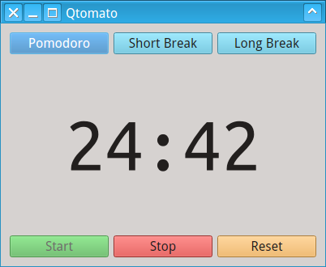

# Qtomato

A cross-platform app built using Qt5 to follow [Pomodoro Technique](https://en.wikipedia.org/wiki/Pomodoro_Technique).

# Screenshots

# TODO

* Desktop notification system using audio play
* Taskbar progress report [Windows]
* Upload to Launchpad